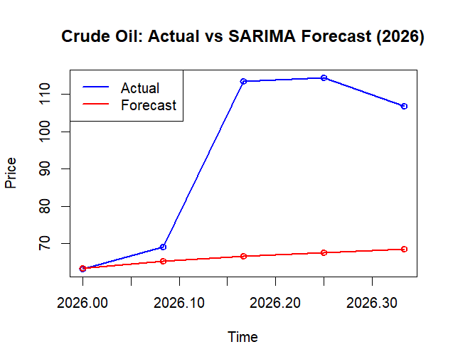

# Time Series Analysis of Crude Oil Price, Gold Price and Exchange Rate

**Modelling and forecasting crude oil, gold, and the USD/INR exchange rate for the Indian economy — classical econometrics vs. machine learning.**


📄 **[Read the full dissertation (PDF)](FINALPROJECT.pdf)** — complete methodology, derivations, and results.

---

## Table of Contents

- [Overview](#overview)
- [Objectives](#objectives)
- [Theoretical Framework](#theoretical-framework)
- [Data Sources](#data-sources)
- [Methodology & Tools](#methodology--tools)
- [Time Series Overview](#time-series-overview)
- [Model Performance](#model-performance)
- [Model Diagnostics](#model-diagnostics)
- [Key Findings](#key-findings)
- [Full Report](#-full-report)
- [Repository Structure](#repository-structure)
- [Author](#author)

---

## Overview

This project models and forecasts three economically interlinked series — **crude oil price**, **gold price**, and the **USD/INR exchange rate** — and examines how they relate to one another over time. It combines classical econometric modelling (ARIMA, SARIMA, ETS, GARCH, VECM) with modern machine learning approaches (Random Forest, XGBoost, LSTM), and rigorously compares their forecasting performance using walk-forward validation.

## Objectives

1. Identify the most suitable time series model for forecasting the **monthly price of crude oil**, evaluated through out-of-sample forecast accuracy.
2. Determine the best-performing forecasting model for the **daily price of gold** by comparing ARIMA and exponential smoothing (ETS) approaches.
3. Identify the most appropriate model for forecasting the **daily USD/INR exchange rate**, assessed against naive and random-walk benchmarks.
4. Examine the **long-run and short-run relationships** among crude oil, gold, and the exchange rate, and the direction of influence between them.
5. Compare the forecasting performance of **classical time series models vs. machine learning models**, and assess whether differences in accuracy are meaningful.

## Theoretical Framework

| Concept | Purpose in this study |
|---|---|
| **Stationarity & Unit Root Testing** (ADF, KPSS) | Determine whether each series needed differencing before modelling |
| **Box-Jenkins ARIMA/SARIMA** | Model each series from its own past values and forecast errors, using ACF/PACF and AIC/BIC |
| **Exponential Smoothing (ETS)** | Benchmark forecasting approach that weights recent observations more heavily |
| **GARCH(1,1), Student-t** | Capture volatility clustering in financial series |
| **Johansen Cointegration & VECM** | Test for a stable long-run relationship across crude oil, gold, and the exchange rate |
| **Granger Causality & Impulse Response** | Study the direction of influence and shock propagation between series |
| **Random Forest, XGBoost, LSTM** | Modern ML alternatives tested against classical models for gold and exchange rate forecasting |

## Data Sources

All data was drawn from authoritative Indian government or exchange databases:

| Series | Frequency | Source | Period | Observations |
|---|---|---|---|---|
| Crude oil price (Indian Basket, USD/barrel) | Monthly | PPAC, Ministry of Petroleum and Natural Gas | Apr 2000 – May 2026 | 314 |
| Gold price (INR/10g) | Daily | National Stock Exchange of India (NSE) | Jan 2020 – May 2026 | 1,537 |
| Gold price (INR/10g) | Monthly | Reserve Bank of India (RBI) | Apr 2000 – May 2026 | — |
| USD/INR exchange rate | Daily & Monthly | Investing.com historical database | Daily from Jan 2020, Monthly from Apr 2000 | — |

## Methodology & Tools

| Task | Language / Packages |
|---|---|
| ARIMA, SARIMA, GARCH, Johansen test, VECM, Granger causality, IRF | **R** — `forecast`, `tseries`, `urca`, `vars`, `rugarch` |
| Random Forest, XGBoost, LSTM | **Python** — `scikit-learn`, `XGBoost`, `TensorFlow`/`Keras` |

## Time Series Overview

**Time Series Plot for VECM** — crude oil, gold, and USD/INR series used in the multivariate analysis.

<!-- Add plot image here, e.g.: -->
 

## Model Performance

**Actual vs. Forecasted** — comparison of actual values against model forecasts on the out-of-sample test data.

<!-- Add forecast comparison plot here, e.g.: -->
  

## Model Diagnostics

**ACF and PACF** — autocorrelation and partial autocorrelation plots used to identify model order and validate residuals.

<!-- Add diagnostic plots here, e.g.: -->
 

## Key Findings

- Identified **ARIMA(2,1,1)** as the best-fitting model for monthly Indian crude oil prices, with residuals passing all standard diagnostic checks.
- A simple **ETS Holt model** out-forecasts ARIMA for daily gold prices on held-out data; a **random walk with drift** is competitive for the USD/INR exchange rate.
- Fitted **GARCH(1,1)** volatility models for all three series, revealing three distinct volatility signatures:
  - **Crude oil** — reactive, non-persistent
  - **Gold** — moderate persistence, fat tails
  - **Exchange rate** — near-permanent persistence
- Established, via **Johansen's test and a VECM**, a statistically significant long-run equilibrium relationship among crude oil, gold, and the exchange rate, with clearly defined adjustment dynamics and causal direction.
- Through a rigorous **walk-forward comparison**, classical statistical models **outperformed** Random Forest, XGBoost, and LSTM for forecasting daily gold and exchange rate prices in this setting.

## 📄 Full Report

The complete dissertation — including full derivations, code walkthroughs, diagnostic plots, and detailed results — is available here:

**[📥 Download the full report (PDF)](FINALPROJECT.pdf)**

## Repository Structure

```
.
├── data/               # Raw and processed datasets
├── R/                  # ARIMA, SARIMA, GARCH, VECM, Granger causality, IRF scripts
├── python/             # Random Forest, XGBoost, LSTM models
├── notebooks/          # Exploratory analysis and diagnostics
├── report/             # Full dissertation PDF and supporting figures
└── README.md
```

## Author

**Aswani A**
M.Sc. Statistics, University of Kerala

---
